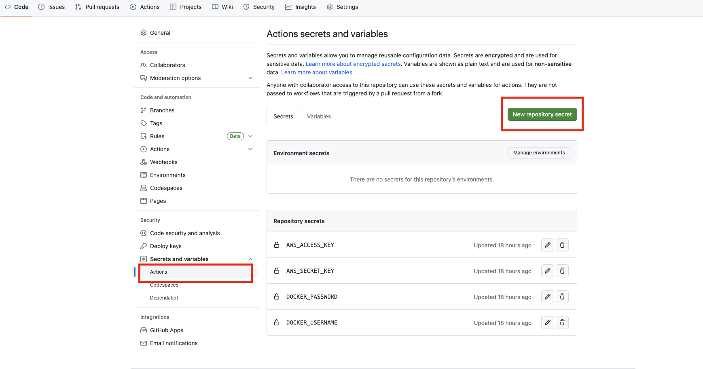

# Docker, React and Elastic Beanstalk template

This project was created with `create-react-app` and `docker`. It's a simple pipeline designed to deploy to AWS Elastic Beanstalks.

## Deployment to Elastic Beanstalk

This project uses github actions to deploy to AWS EB. Configuration can be found in `.github/workflows/deploy.yaml`. Configuration has been based on [beanstalk-deploy](https://github.com/einaregilsson/beanstalk-deploy). Deployment is triggered by a code merge to `main` branch.

## Prerequisite

In order for the pipeline to be functional you need to set up an EB application in AWS. You can find instructions on how to sign up here [AWS free tier](https://aws.amazon.com/free/?trk=bd20e73c-a932-469f-b6cf-0872a618ab7c&sc_channel=ps&ef_id=EAIaIQobChMIoKmSrZDj_wIV0OrtCh3y_wgQEAAYASAAEgKx1vD_BwE:G:s&s_kwcid=AL!4422!3!661270826084!e!!g!!aws%20free%20tier!20187389987!149698005739&all-free-tier.sort-by=item.additionalFields.SortRank&all-free-tier.sort-order=asc&awsf.Free%20Tier%20Types=*all&awsf.Free%20Tier%20Categories=*all). To create a EB application, follow the steps below:

**Create EC2 IAM Role**

1. Go to AWS Management Console
2. Search for **IAM** and click the IAM Service.
3. Click **Roles** under **Access Management **in the left sidebar.
4. Click the **Create role** button.
5. Select **AWS Service** under **Trusted entity type** . Then select **EC2** under **common use cases** .
6. Search for **AWSElasticBeanstalk** and select both the **AWSElasticBeanstalkWorkerTier** and **AWSElasticBeanstalkMulticontainerDocker** policies. Click the **Next** button.
7. Give the role the name of **aws-elasticbeanstalk-ec2-role**
8. Click the **Create role** button.

**Create Elastic Beanstalk Environment**

1. Go to AWS Management Console
2. Search for **Elastic Beanstalk** and click the Elastic Beanstalk service.
3. If you've never used Elastic Beanstalk before you will see a splash page. Click the **Create Application** button. If you have created Elastic Beanstalk environments and applications before, you will be taken directly to the Elastic Beanstalk dashboard. In this case, click the **Create environment** button. There is now a flow of 6 steps that you will be taken through.
4. You will need to provide an Application name, which will auto-populate an Environment Name.
5. Scroll down to find the Platform section. You will need to select the Platform of Docker. This will auto-populate the rest of the fields.
6. Scroll down to the Presets section and make sure that **free tier eligible** has been selected:
7. Click the **Next** button to move to Step #2.
8. You will be taken to a Service Access configuration form.

If you are presented with a blank form where the **Existing Service Roles** field is empty, then, you should select **Create and use new service role** . You will need to set the **EC2 instance profile** to the **aws-elasticbeanstalk-ec2-role **created earlier (this may be auto-populated for you).

If both **Existing Service Roles** and **EC2 Instance Profiles **are populated with default values, then, select **Use an existing service role** .

10. Click the **Skip to Review** button as Steps 3-6 are not applicable.
11. Click the **Submit** button and wait for your new Elastic Beanstalk application and environment to be created and launch.
12. Click the link below the checkmark under Domain. This should open the application in your browser and display a Congratulations message.

**Update Object Ownership of S3 Bucket**

1. Go to AWS Management Console
2. Search for **S3** and click the S3 service.
3. Find and click the elasticbeanstalk bucket that was automatically created with your environment.
4. Click **Permissions** menu tab
5. Find **Object Ownership** and click **Edit**
6. Change from **ACLs disabled** to **ACLs enabled** . Change **Bucket owner Preferred** to **Object Writer** . Check the box acknowledging the warning.
7. Click **Save changes** .

**Create an IAM User**

1. Search for the "IAM Security, Identity & Compliance Service"
2. Click "Create Individual IAM Users" and click "Manage Users"
3. Click "Add User"
4. Enter any name you’d like in the "User Name" field.

eg: docker-react-github-ci

5. Click "Next"
6. Click "Attach Policies Directly"
7. Search for "beanstalk"
8. Tick the box next to "AdministratorAccess-AWSElasticBeanstalk"
9. Click "Next"
10. Click "Create user"
11. Select the IAM user that was just created from the list of users
12. Click "Security Credentials"
13. Scroll down to find "Access Keys"
14. Click "Create access key"
15. Select "Command Line Interface (CLI)"
16. Scroll down and tick the "I understand..." check box and click "Next"
17. Copy and/or download the _Access Key ID_ and _Secret Access Key_ to use in the Github Variable Setup.

**Create repository secrets**

1. Navigate to your Github repository.
2. Click **Settings**
3. Click **Actions**
4. Click **New repository secret**
5. Create key/value pair secrets for **AWS_ACCESS_KEY** , **AWS_SECRET_KEY** , **DOCKER_USERNAME** , **DOCKER_PASSWORD** .

**IMPORTANT**

Remember to change your `application_name` , `environment_name` , `existing_bucket_name`, and `region` to the values used by your AWS Elastic Beanstalk environment
